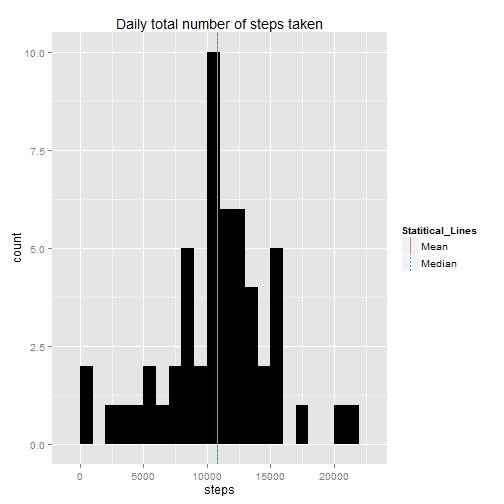
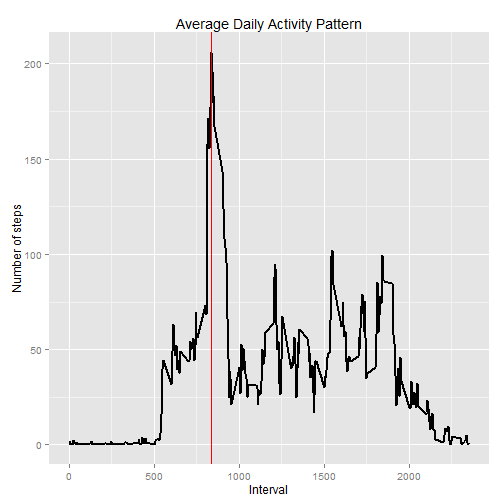
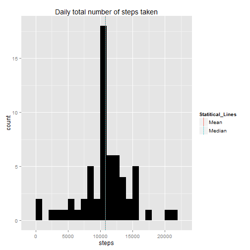
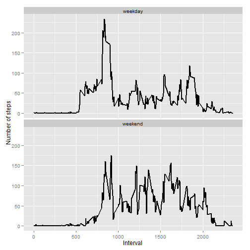

# Reproducible Research: Peer Assessment 1

This assignment makes use of data from a personal activity monitoring device. This device collects data at 5 minute intervals through out the day. The data consists of two months of data from an anonymous individual collected during the months of October and November, 2012 and include the number of steps taken in 5 minute intervals each day.

## Loading and preprocessing the data
1. Load Data from CSV file into data frame.
2. The interval column is converted to factor type.
3. The date column is converted to Date type.
4. The data is examined by using summary and str methods on it.


```r
library(ggplot2)
tbl <- read.csv("activity.csv", header=T, colClasses=c("numeric", "character", "numeric"))
tbl$interval <- factor(tbl$interval)
tbl$date <- as.Date(tbl$date, format="%Y-%m-%d")
```

Checking Data.

```r
summary(tbl)
```

```
##      steps            date               interval    
##  Min.   :  0.0   Min.   :2012-10-01   0      :   61  
##  1st Qu.:  0.0   1st Qu.:2012-10-16   5      :   61  
##  Median :  0.0   Median :2012-10-31   10     :   61  
##  Mean   : 37.4   Mean   :2012-10-31   15     :   61  
##  3rd Qu.: 12.0   3rd Qu.:2012-11-15   20     :   61  
##  Max.   :806.0   Max.   :2012-11-30   25     :   61  
##  NA's   :2304                         (Other):17202
```

```r
str(tbl)
```

```
## 'data.frame':	17568 obs. of  3 variables:
##  $ steps   : num  NA NA NA NA NA NA NA NA NA NA ...
##  $ date    : Date, format: "2012-10-01" "2012-10-01" ...
##  $ interval: Factor w/ 288 levels "0","5","10","15",..: 1 2 3 4 5 6 7 8 9 10 ...
```

## What is mean total number of steps taken per day?

Code to plot data and draw its histogram, plus two lines for mean and median.


```r
steps_per_day <- aggregate(steps ~ date, tbl, sum)
colnames(steps_per_day) <- c("date", "steps")

mean_steps = round(mean(steps_per_day$steps), 2)
median_steps = round(median(steps_per_day$steps), 2)

mean_line <- data.frame(Statitical_Lines="Mean", vals=c(mean_steps))
median_line <- data.frame(Statitical_Lines="Median", vals=c(median_steps))

lines <- rbind(mean_line,median_line)

ggplot(data=steps_per_day, aes(x=steps)) +
  geom_histogram(fill="black", binwidth=1000) +
  geom_vline(data=lines, 
             aes(xintercept=vals, 
                 linetype=Statitical_Lines,
                 colour = Statitical_Lines),
             show_guide = TRUE)+
  ggtitle("Daily total number of steps taken")
```

 

**For the total number of steps taken per day:**  
- **Mean: 10766.19**
- **Median: 10765**


## What is the average daily activity pattern?

Plot of average daily pattern with a line shows the maximum.


```r
steps_pi <- aggregate(tbl$steps, by=list(interval=tbl$interval),
                        FUN=mean, na.rm=T)
steps_pi$interval <- as.integer(levels(steps_pi$interval)[steps_pi$interval])
colnames(steps_pi) <- c("interval", "steps")

max_step_interval <- steps_pi[which.max(steps_pi$steps),]$interval

cols = c("red")

ggplot(steps_pi, aes(x=interval, y=steps)) +   
  geom_line(color="black", size=1) +  
  geom_vline(aes(xintercept=max_step_interval, color="red")) +  
  scale_color_manual(name=element_blank(), values=cols) +     
  labs(title="Average Daily Activity Pattern", x="Interval", y="Number of steps")
```

 

**5 minutes interval which contains the maximun number of steps:835**

## Imputing missing values

Replacing missing values with the mean value at the same interval across days.


```r
na_indices <- which(is.na(tbl$steps))
defaults <- steps_pi
na_replacements <- unlist(lapply(na_indices, FUN=function(idx){
  interval = tbl[idx,]$interval
  defaults[defaults$interval == interval,]$steps
}))
imputed_steps <- tbl$steps
imputed_steps[na_indices] <- na_replacements

full_tbl <- data.frame(  
  steps = imputed_steps,  
  date = tbl$date,  
  interval = tbl$interval)
```

Imputed values summary:

```r
summary(full_tbl)
```

```
##      steps            date               interval    
##  Min.   :  0.0   Min.   :2012-10-01   0      :   61  
##  1st Qu.:  0.0   1st Qu.:2012-10-16   5      :   61  
##  Median :  0.0   Median :2012-10-31   10     :   61  
##  Mean   : 37.4   Mean   :2012-10-31   15     :   61  
##  3rd Qu.: 27.0   3rd Qu.:2012-11-15   20     :   61  
##  Max.   :806.0   Max.   :2012-11-30   25     :   61  
##                                       (Other):17202
```

Histogram of the total number of steps taken each day


```r
complete_steps_per_day <- aggregate(steps ~ date, full_tbl, sum)
colnames(complete_steps_per_day) <- c("date", "steps")

complete_mean_steps = round(mean(complete_steps_per_day$steps), 2)
complete_median_steps = round(median(complete_steps_per_day$steps), 2)

mean_line <- data.frame(Statitical_Lines="Mean", vals=c(complete_mean_steps))
median_line <- data.frame(Statitical_Lines="Median", vals=c(complete_median_steps))

lines <- rbind(mean_line,median_line)

ggplot(data=complete_steps_per_day, aes(x=steps)) +
  geom_histogram(fill="black", binwidth=1000) +
  geom_vline(data=lines, 
             aes(xintercept=vals, 
                 linetype=Statitical_Lines,
                 colour = Statitical_Lines),
             show_guide = TRUE)+
  ggtitle("Daily total number of steps taken")
```

 

**For the total number of steps taken per day after filling missing data:**  
- **Mean: 10766.19**
- **Median: 10766.19**

## Are there differences in activity patterns between weekdays and weekends?

Code to plot the Weekdays and Weekend days


```r
tbl$weekday <- as.factor(weekdays(tbl$date))
weekend_data <- subset(tbl, weekday %in% c("Saturday","Sunday"))
weekday_data <- subset(tbl, !weekday %in% c("Saturday","Sunday"))

weekend_spi <- aggregate(weekend_data$steps, by=list(interval=weekend_data$interval),
                          FUN=mean, na.rm=T)
weekend_spi$interval <- as.integer(levels(weekend_spi$interval)[weekend_spi$interval])
colnames(weekend_spi) <- c("interval", "steps")

weekday_spi <- aggregate(weekday_data$steps, by=list(interval=weekday_data$interval),
                          FUN=mean, na.rm=T)
weekday_spi$interval <- as.integer(levels(weekday_spi$interval)[weekday_spi$interval])
colnames(weekday_spi) <- c("interval", "steps")


weekend_spi$dayofweek <- rep("weekend", nrow(weekend_spi))
weekday_spi$dayofweek <- rep("weekday", nrow(weekday_spi))

day_of_week_data <- rbind(weekend_spi, weekday_spi)
day_of_week_data$dayofweek <- as.factor(day_of_week_data$dayofweek)

ggplot(day_of_week_data, 
       aes(x=interval, y=steps)) + 
  geom_line(color="black", size=1) + 
  facet_wrap(~ dayofweek, nrow=2, ncol=1) +
  labs(x="Interval", y="Number of steps")
```

 
